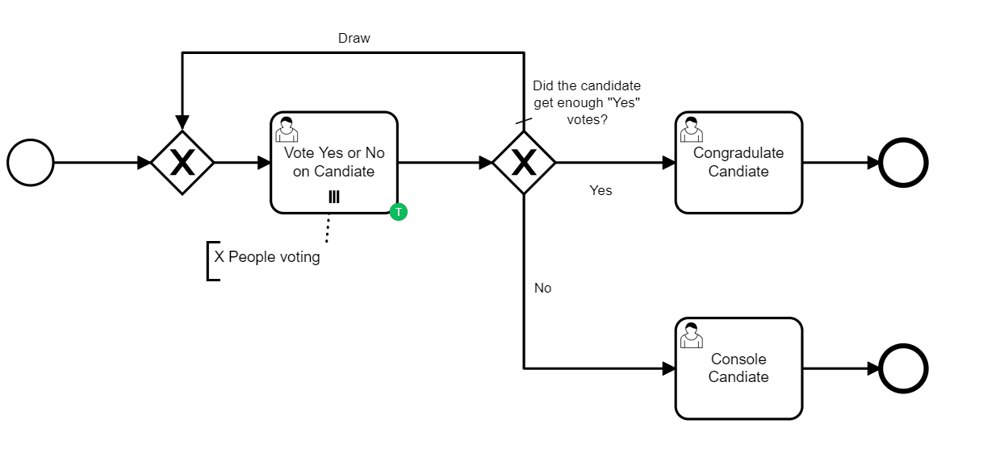

# Camunda Multi-Instance User Task Example

This is a simple example project to help demonstrate how inputs from multiple 
users can be gathered together to help decide how the process should proceed based on the 
user consensus. 

The example uses the idea of a vote. Where X users in parallel are asked to cast a vote
`yes`or `no`for a candidate. If the majority vote `yes` the process moves on to a user task congradulated the 
victor is not, we console them. 



## To Run the Project
This is a Spring Boot project with an embedded Camunda engine. 
To run it simply import it into your Java IDE and build it with maven to get the dependencies
and run the ``Application.java`` class from within your IDE. 

## How does it work

When the process starts it will create a user task for each vote needed.
After each user task is completed a listener will add the vote to the running tally.

```java

@Named
public class VoteCountListener implements TaskListener {

    @Override
    public void notify(DelegateTask delegateTask) {
        // Get the current variables
        Long yesVotes = (Long) delegateTask.getVariable("yesVotes");
        Long noVotes = (Long) delegateTask.getVariable("noVotes");
        boolean approved = (boolean)delegateTask.getVariable("approved");

        if(approved){
            delegateTask.setVariable("yesVotes", yesVotes+1L);
        }else{
            delegateTask.setVariable("noVotes", noVotes+1L);
        }
        
        // Now i'll removed the variables so that no other task are affected by it.
        delegateTask.removeVariable("approved");
        delegateTask.removeVariable("name");


    }
}

```
After all votes are completed a simple expression on the sequence flows leaving the 
XOR gateway will decide on the direction. 
`` #{yesVotes > noVotes} `` in the case of a draw votes will be recast. 

If you feel this example is missing something, I'm very happy to get pull requests. 